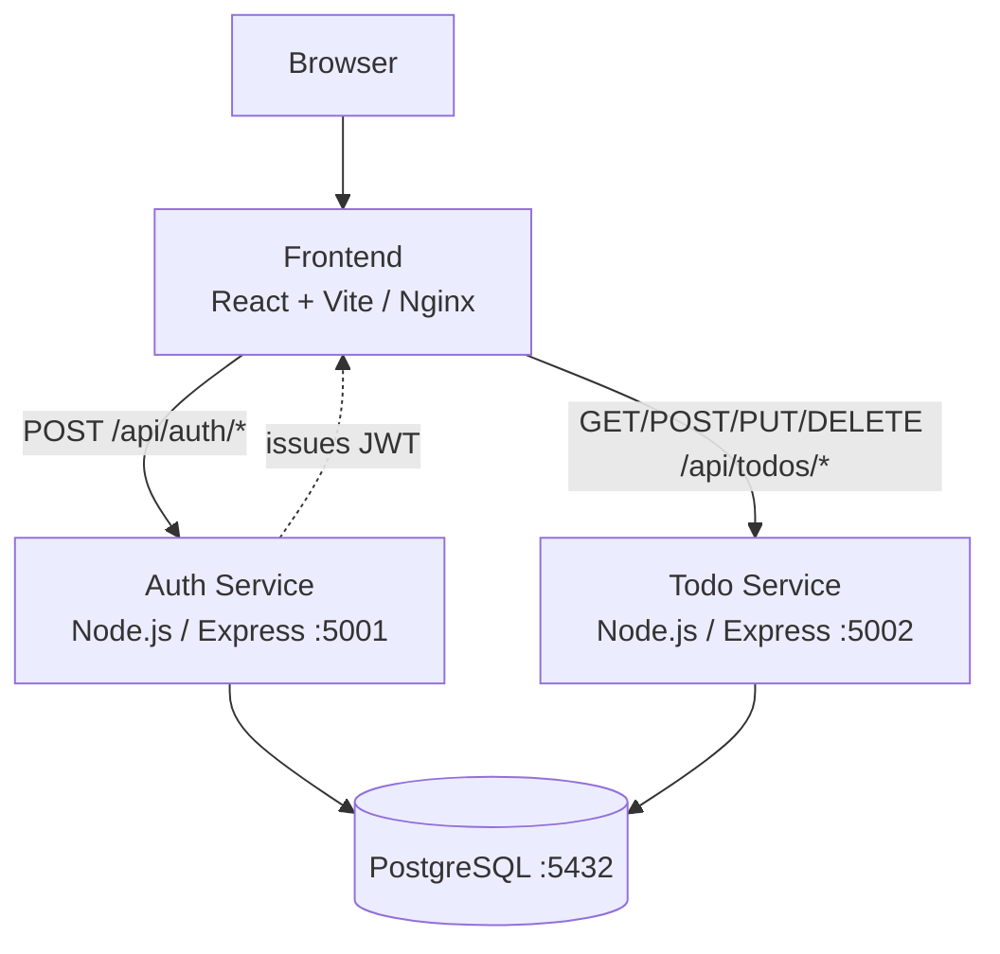

# Todo Platform — Application

Source code for the microservices-based Todo Platform. Three independently deployable services backed by PostgreSQL, with a GitHub Actions CI pipeline that builds, tests, scans, and pushes Docker images to GHCR.

## Architecture



## Services

| Service | Local Port | Image |
|---|---|---|
| `frontend` | 5173 | `ghcr.io/rajdeepmishra01/frontend` |
| `auth-service` | 5001 | `ghcr.io/rajdeepmishra01/auth-service` |
| `todo-service` | 5002 | `ghcr.io/rajdeepmishra01/todo-service` |
| `postgres` | 5432 | `postgres:16-alpine` |

## Quick Start

```bash
docker compose up --build
# Open http://localhost:5173
```

## API

**Auth** (`http://localhost:5001/api/auth`):

| Method | Path | Body |
|---|---|---|
| POST | `/register` | `{ username, email, password }` |
| POST | `/login` | `{ email, password }` → returns `{ token }` |

**Todos** (`http://localhost:5002/api/todos`) — requires `Authorization: Bearer <token>`:

| Method | Path | Body |
|---|---|---|
| GET | `/` | — |
| POST | `/` | `{ title }` |
| PUT | `/:id` | `{ title?, completed? }` |
| DELETE | `/:id` | — |

## CI/CD Pipeline

Every push to `main` runs `.github/workflows/pipeline.yml`:

```
Lint (ESLint) → Build (Vite) → Unit Tests (Vitest) → Coverage
→ SonarCloud → Docker Build → Trivy Scan → Push to GHCR (:build-number)
```

After a successful push, Flux in the GitOps repo automatically detects the new image tag and deploys it to Kubernetes.

## Project Structure

```
apps/
  frontend/       React 18 + Vite SPA
  auth-service/   Node.js register / login / JWT
  todo-service/   Node.js JWT-protected todo CRUD
  database/       init.sql (users + todos schema)
.github/workflows/pipeline.yml
docker-compose.yml
sonar-project.properties
```

## Local Development (without Docker)

```bash
npm install                                          # root ESLint deps
cd apps/auth-service && npm install && npm run dev
cd apps/todo-service && npm install && npm run dev
cd apps/frontend    && npm install && npm run dev
# PostgreSQL must be running separately on port 5432
```

## Docs

| File | Description |
|---|---|
| [docs/architecture.md](docs/architecture.md) | Mermaid diagrams — component, auth flow, CI/CD |
| [docs/commands.md](docs/commands.md) | Docker Compose, API curl, test commands |
| [docs/demo-script.md](docs/demo-script.md) | Live demo walkthrough |
| [docs/troubleshooting.md](docs/troubleshooting.md) | Common issues and fixes |

## Related Repository

**[major-assignment-gitops](https://github.com/rajdeepmishra01/major-assignment-gitops)** — Kubernetes manifests, Helm chart, Flux GitOps, monitoring, security, and policies.