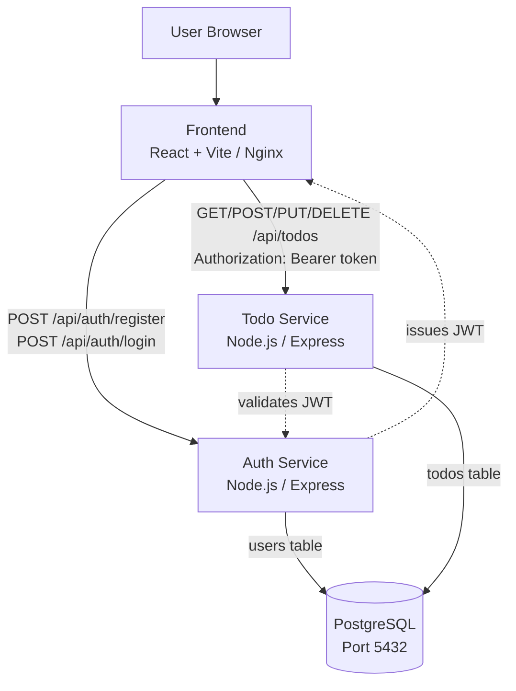
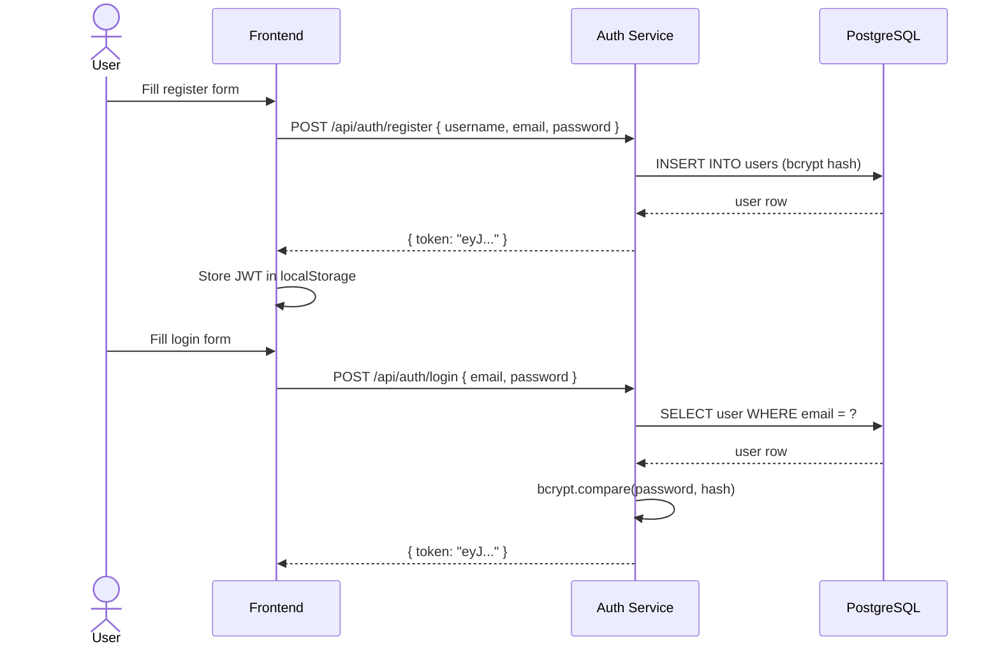
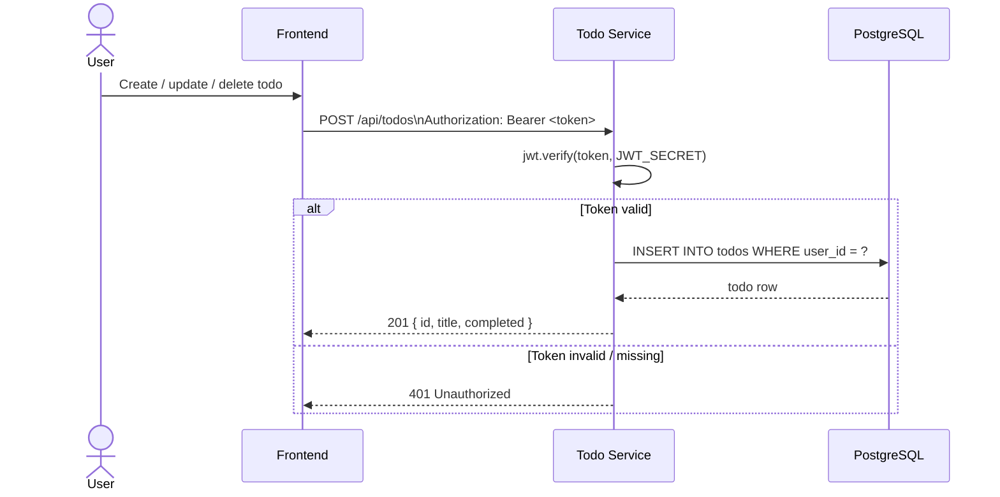
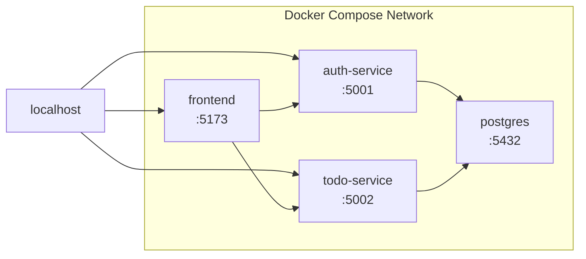
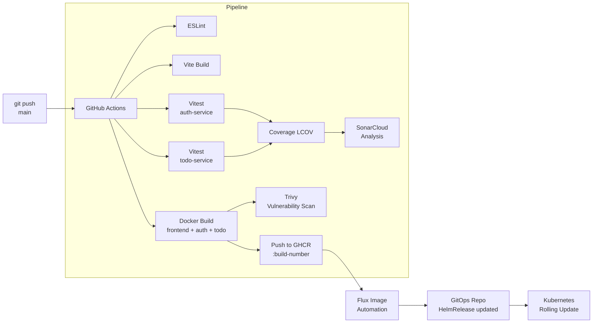

# Architecture — Todo Platform Application

## Services

| Service | Port (local) | Port (k8s) | Role |
|---|---|---|---|
| `frontend` | 5173 | 80 | React SPA served by Nginx |
| `auth-service` | 5001 | 3001 | User register / login / JWT |
| `todo-service` | 5002 | 3002 | JWT-protected todo CRUD |
| `postgres` | 5432 | 5432 | PostgreSQL 16 |

---

## Application Architecture



---

## Authentication Flow



---

## Todo Request Flow (JWT-protected)



---

## Docker Compose Network



---

## CI/CD Pipeline Flow



---

## Database Schema

```sql
-- users table (owned by auth-service)
CREATE TABLE users (
    id       SERIAL PRIMARY KEY,
    username VARCHAR(50)  UNIQUE NOT NULL,
    email    VARCHAR(100) UNIQUE NOT NULL,
    password VARCHAR(255) NOT NULL,           -- bcrypt hash
    created_at TIMESTAMPTZ DEFAULT NOW()
);

-- todos table (owned by todo-service)
CREATE TABLE todos (
    id         SERIAL PRIMARY KEY,
    user_id    INTEGER REFERENCES users(id) ON DELETE CASCADE,
    title      VARCHAR(255) NOT NULL,
    completed  BOOLEAN DEFAULT FALSE,
    created_at TIMESTAMPTZ DEFAULT NOW()
);
```

---

## Key Design Decisions

- **Auth service owns passwords.** The todo service never touches the `users` table directly. It only validates the JWT to extract `user_id`.
- **Shared `JWT_SECRET`.** Both services read `JWT_SECRET` from the same Kubernetes Secret (or Docker Compose env). Auth signs, Todo verifies.
- **User-scoped todos.** Every todo query filters by `user_id` decoded from the token — a user can only see and modify their own todos.
- **Metrics endpoint.** Both backend services expose `/metrics` (via `prom-client`) for Prometheus scraping in Kubernetes.
